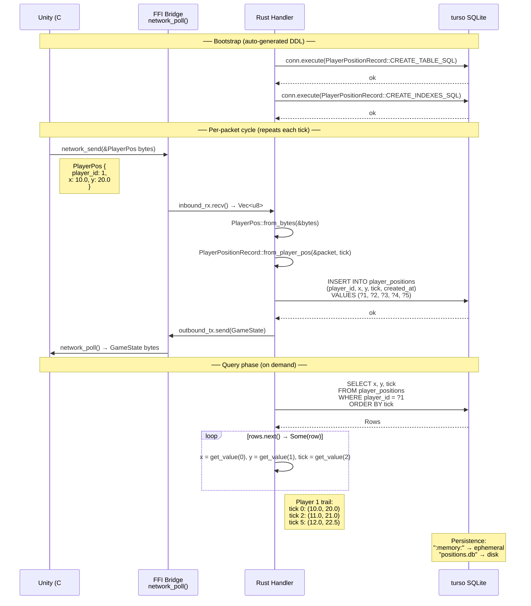

# unity-network

Safe Rust FFI bridge for Unity, providing WebTransport networking with zero-copy packet handling and auto-schema database persistence.

## Architecture

```
┌─────────┐     FFI (cdylib)     ┌───────────────────┐     WebTransport     ┌──────────────┐
│  Unity  │ ◄──────────────────► │  unity-network    │ ◄──────────────────► │ Game Server  │
│  (C#)   │   network_*() calls  │  (Rust cdylib)    │   QUIC/HTTP3         │ (wtransport) │
└─────────┘                      └───────────────────┘                      └──────────────┘
                                          │
                                          ▼
                                   ┌──────────────┐
                                   │ turso SQLite │
                                   │ (persistence)│
                                   └──────────────┘
```

**Unity is VIEW-ONLY** — no business logic, no state, no networking. Rust handles everything.

## Auto Schema Flow

The `schema_turso` example demonstrates recording player positions from network packets into a turso SQLite database using auto-generated DDL from `#[derive(GameComponent)]`.

```mermaid
stateDiagram-v2
    [*] --> InspectSchema : cargo run --example schema_turso

    InspectSchema --> CreateTable : Auto-generated constants
    note right of InspectSchema
        #[derive(GameComponent)]
        #[db_table("player_positions")]
        #[game_ffi(skip_crud)]
        
        Generates:
        - TABLE_NAME
        - CREATE_TABLE_SQL
        - CREATE_INDEXES_SQL
    end note

    CreateTable --> ReadyDB : conn.execute(CREATE_TABLE_SQL)
    note right of CreateTable
        CREATE TABLE IF NOT EXISTS player_positions (
            id BIGINT PRIMARY KEY,
            player_id BIGINT NOT NULL,
            x REAL NOT NULL,
            y REAL NOT NULL,
            tick BIGINT NOT NULL,
            created_at BIGINT NOT NULL
        )
    end note

    ReadyDB --> ReceivePacket : WebTransport / simulated
    note right of ReadyDB
        CREATE INDEX IF NOT EXISTS
        idx_player_positions_player_id
        ON player_positions(player_id)
    end note

    ReceivePacket --> ConvertToRecord : PlayerPos (FFI packet)
    note right of ReceivePacket
        PlayerPos {
            request_uuid: Uuid,
            player_id: u64,
            x: f32, y: f32
        }
    end note

    ConvertToRecord --> InsertRow : PlayerPositionRecord::from_player_pos()
    note right of ConvertToRecord
        PlayerPositionRecord {
            id: 0, -- auto-assigned
            player_id, x, y, tick,
            created_at: now()
        }
    end note

    InsertRow --> ReceivePacket : More packets?
    note right of InsertRow
        INSERT INTO player_positions
        (player_id, x, y, tick, created_at)
        VALUES (?1, ?2, ?3, ?4, ?5)
    end note

    InsertRow --> QueryAll : No more packets

    QueryAll --> QueryByPlayer : SELECT * ORDER BY id
    QueryByPlayer --> [*] : WHERE player_id = ?1

    state ReadyDB {
        [*] --> MemoryDB : ":memory:"
        MemoryDB --> DiskDB : "positions.db"
    }
```

## Data Flow Sequence

The sequence below shows the full lifecycle: Unity sends a `PlayerPos` packet, Rust converts it to a `PlayerPositionRecord`, persists to turso SQLite, then queries it back.



## Packet Types

All packets use `#[repr(C)]` with `#[derive(GameComponent)]` for guaranteed memory layout matching between Rust and C#.

| Packet | Purpose | Fields |
|--------|---------|--------|
| `PacketHeader` | Common header | `packet_type`, `magic` (0xCC) |
| `PlayerPos` | Player position update | `request_uuid`, `player_id`, `x`, `y` |
| `GameState` | Server state snapshot | `tick`, `player_count`, `reserved` |
| `SpriteMessage` | Sprite CRUD operations | `operation`, `sprite_type`, `id`, `x`, `y` |

## Single Source of Truth — `Position2D`

Position fields are defined **once** in `Position2D` and shared between the FFI packet and DB row via composition:

```
Position2D (player_id, x, y)
    ├── PlayerPos          (FFI packet = header + Position2D)
    └── PlayerPositionRecord (DB row = metadata + Position2D via #[db_flatten])
```

Adding `z`, `rotation`, `velocity` etc. to `Position2D` auto-propagates everywhere.

| Struct | Table | Role |
|--------|-------|------|
| `Position2D` | `position_2d` | Shared position payload (single source of truth) |
| `PlayerPositionRecord` | `player_positions` | DB row with `#[db_flatten]` expanding `Position2D` columns |

All annotated with `#[db_table]` for auto DDL. Uses `#[game_ffi(skip_crud)]` since CRUD queries are written manually for turso (generated CRUD targets sqlx/PostgreSQL).

## Examples

| Example | Description | Run |
|---------|-------------|-----|
| `schema_turso` | Auto-schema DDL + turso SQLite persistence | `cargo run --package unity-network --example schema_turso` |
| `extract_bindings` | Print generated C# bindings for each struct | `cargo run --package unity-network --example extract_bindings` |
| `extract_layout` | Show memory layout (offsets, sizes, padding) | `cargo run --package unity-network --example extract_layout` |
| `extract_uuids` | Print auto-generated UUID v7 values | `cargo run --package unity-network --example extract_uuids` |
| `generate_unity_cs` | Generate complete `GameFFI.cs` file | `cargo run --package unity-network --example generate_unity_cs` |

## Quick Start

### Define shared payload + FFI packet + DB record

```rust
use game_ffi::GameComponent;

// 1. Shared payload — single source of truth for position data
#[repr(C)]
#[derive(Debug, Clone, Copy, GameComponent)]
#[game_ffi(skip_zero_copy, skip_ffi, skip_crud)]
#[db_table("position_2d")]
pub struct Position2D {
    pub player_id: u64,
    pub x: f32,
    pub y: f32,
}

// 2. FFI packet = header + shared payload
#[repr(C)]
#[derive(GameComponent, Debug, Clone, Copy)]
pub struct PlayerPos {
    pub packet_type: u8,
    pub magic: u8,
    pub request_uuid: uuid::Uuid,
    pub pos: Position2D,
}

// 3. DB record = metadata + flattened shared payload
#[derive(Debug, Clone, GameComponent)]
#[game_ffi(skip_zero_copy, skip_ffi, skip_crud)]
#[db_table("player_positions")]
#[db_index(name = "idx_player_positions_player_id", on = "player_id")]
pub struct PlayerPositionRecord {
    #[primary_key]
    pub id: i64,
    #[db_flatten]  // expands Position2D columns into this table
    pub pos: Position2D,
    pub tick: u32,
    pub created_at: i64,
}
```

### Create table and insert records

```rust
let db = turso::Builder::new_local(":memory:").build().await?;
let conn = db.connect()?;

// Composed DDL — #[db_flatten] uses runtime composition (fn, not const)
conn.execute(PlayerPositionRecord::create_table_sql(), ()).await?;
conn.execute(PlayerPositionRecord::CREATE_INDEXES_SQL, ()).await?;

// FFI packet → DB record: just copy the shared payload
let packet = PlayerPos::new(uuid::Uuid::now_v7(), player_id, x, y);
let record = PlayerPositionRecord::from_player_pos(&packet, tick);

// Insert with parameterized query (flattened columns: player_id, x, y)
conn.execute(
    "INSERT INTO player_positions (player_id, x, y, tick, created_at) VALUES (?1, ?2, ?3, ?4, ?5)",
    [turso::Value::Integer(record.pos.player_id as i64), turso::Value::Real(record.pos.x as f64),
     turso::Value::Real(record.pos.y as f64), turso::Value::Integer(record.tick as i64),
     turso::Value::Integer(record.created_at)],
).await?;

// Query by indexed column
let mut rows = conn.query(
    "SELECT x, y, tick FROM player_positions WHERE player_id = ?1 ORDER BY tick",
    [turso::Value::Integer(target_player as i64)],
).await?;
while let Some(row) = rows.next().await? {
    let x = row.get_value(0)?.as_real().copied().unwrap_or(0.0);
    let y = row.get_value(1)?.as_real().copied().unwrap_or(0.0);
    let tick = row.get_value(2)?.as_integer().copied().unwrap_or(0);
    println!("tick {tick}: ({x:.1}, {y:.1})");
}
```

## Attribute Reference

### Struct-level

| Attribute | Purpose |
|-----------|---------|
| `#[db_table("name")]` | Auto-generate SQL DDL constants |
| `#[game_ffi(skip_crud)]` | Skip sqlx CRUD generation (use with turso) |
| `#[game_ffi(skip_zero_copy)]` | Skip `as_bytes()`/`from_bytes()` generation |
| `#[game_ffi(skip_ffi)]` | Skip `extern "C"` FFI function generation |
| `#[hash = "all"`] | Strict UUID mode (all attributes) |
| `#[hash = "name"]` | Loose UUID mode (name only) |

### Field-level

| Attribute | Purpose |
|-----------|---------|
| `#[primary_key]` | Mark as primary key column |
| `#[db_flatten]` | Expand embedded struct's columns into parent table |
| `#[db_index(name = "...", on = "...")]` | Generate CREATE INDEX |
| `#[db_default("value")]` | SQL DEFAULT value |
| `#[db_column(TYPE, CONSTRAINTS)]` | Override SQL column type |

### `#[db_flatten]` behavior

| Aspect | Without `#[db_flatten]` | With `#[db_flatten]` |
|--------|------------------------|---------------------|
| `CREATE_TABLE_SQL` | `const &'static str` | `fn create_table_sql() -> String` |
| `COLUMN_DEFS_SQL` | All columns | Own columns only (excludes flattened) |
| `column_names()` | All fields | Own fields only (excludes flattened) |
| Flattened type requirement | N/A | Must have `#[db_table]` (for `COLUMN_DEFS_SQL`) |
| Adding fields to shared type | N/A | Auto-propagates to all users |

## Feature Flags

| Flag | Default | Description |
|------|---------|-------------|
| `unity` | yes | Generate Unity C# bindings |
| `unreal` | yes | Generate Unreal C++ bindings |
